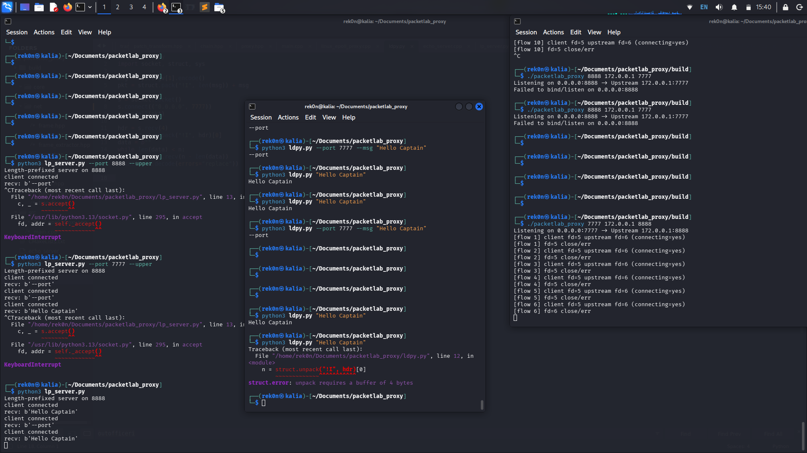

# Liminal Ghostline-Gate

### Think: 
https://activemq.apache.org/components/classic/documentation/mqtt

**Liminal Ghostline-Gate** is a Linux-first, stream-aware relay framework for inspecting and transforming **data in transit** without becoming an endpoint.

It operates exclusively in the **liminal space** between sender and receiver — observing, mirroring, and optionally reshaping traffic while preserving continuity, directionality, and ownership boundaries.

> Not the sender.  
> Not the receiver.  
> The threshold where meaning briefly exists.

---

## Core Concept

Liminal Ghostline behaves like a **mirror inserted mid-stream**.

Think *Mission: Impossible* — a laser grid crossed by reflection, not interruption.

- Traffic continues uninterrupted
- Both directions are relayed **simultaneously**
- The system never “owns” the session
- No request/response coupling
- No semantic termination

If one beam pauses, the other continues until physical backpressure applies.

This property is referred to internally as **blackhole-safe mirroring**.

---

## Architecture Overview



Client ───►│ Ghostline │───► Server

Client ───►│ AMQ │───► Server

Server ◄───│ AMQ│◄─── Client

Server ◄───│ Ghostline │◄─── Client

Each direction is:
- independently buffered
- independently framed
- independently flushed

No cross-direction locking.  
No shared semantic state.

---

## What It Is

- A **bidirectional TCP relay**
- Stream-aware (handles fragmentation, reassembly)
- Frame-aware (length-prefixed protocol in lab mode)
- Transformation-capable at the **frame boundary**
- Passive by default
- Deterministic and observable

---

## What It Is Not

- ❌ A TCP packet spoofer
- ❌ A request/response proxy
- ❌ A protocol endpoint
- ❌ A TLS terminator (by default)
- ❌ A traffic generator
- ❌ A man-in-the-middle that owns sessions

Liminal Ghostline does **not** require CA injection, certificate modification, or endpoint compromise.

---

## Blackhole Invariants (Design Guarantees)

Liminal Ghostline enforces three core invariants:

### 1. Directional Independence
Client → Server and Server → Client flows operate independently.

A pause or delay in one direction must not stall the other.

### 2. No Cross-Coupling
Transforms, buffering, or delays in one direction never block the opposite direction.

### 3. No Ownership
The system never waits for:
- a full request before forwarding
- a full response before continuing
- semantic completion of a transaction

Only physics (TCP backpressure) may slow a stream.

---

## Data Flow (Simplified)

recv()
↓
StreamBuffer
↓
FrameExtractor
↓
TransformChain (optional)
↓
Re-encode
↓
outq → EPOLLOUT → send()

All stages are:
- non-blocking
- per-direction
- per-flow isolated

---

## Protocol (Lab / Reference)

Current reference framing:

[ uint32_be length ][ payload bytes ]

This framing exists to:
- validate stream correctness
- prove mirror behavior
- provide a safe transform boundary

The framing layer is replaceable.

---

## Repository Structure

.
├── include/
│ ├── core/
│ ├── net/
│ │ ├── stream_buffer.hpp
│ │ ├── frame_extractor.hpp
│ │ └── encode.hpp
│ └── transform/
│ ├── transform.hpp
│ └── chain.hpp
│
├── src/
│ └── linux_epoll_proxy.cpp
│
├── tools/
│ ├── lp_server.py
│ └── lp_client.py
│
├── image.png
└── README.md
---

## Running the Reference Pipeline

### 1. Start the upstream server (Python)

```bash
python3 tools/lp_server.py --port 8888 --upper

```
2. Start the proxy (C++)

```bash
./packetlab_proxy 7777 127.0.0.1 8888
```
3. Send traffic through the mirror
```bash
python3 tools/lp_client.py --port 7777 --msg "hello world"
```
Expected result:
```bash
client receives response
server logs RX/TX
proxy relays both directions simultaneously
no deadlock, no stall, no loop
```
