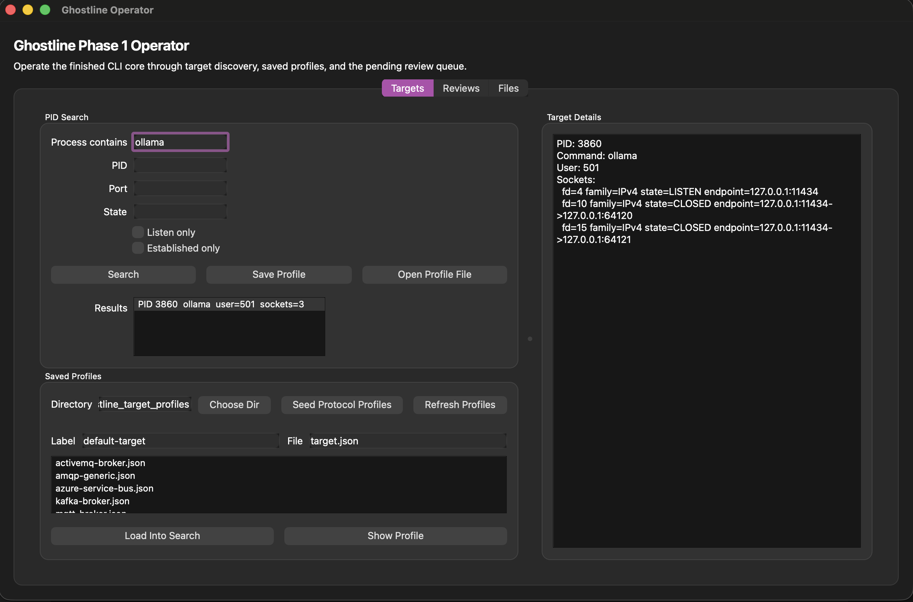
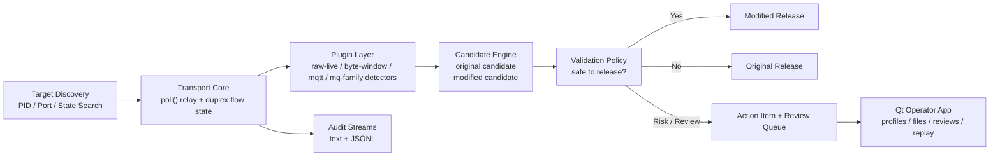
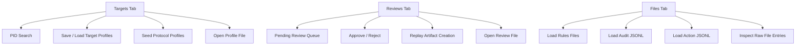
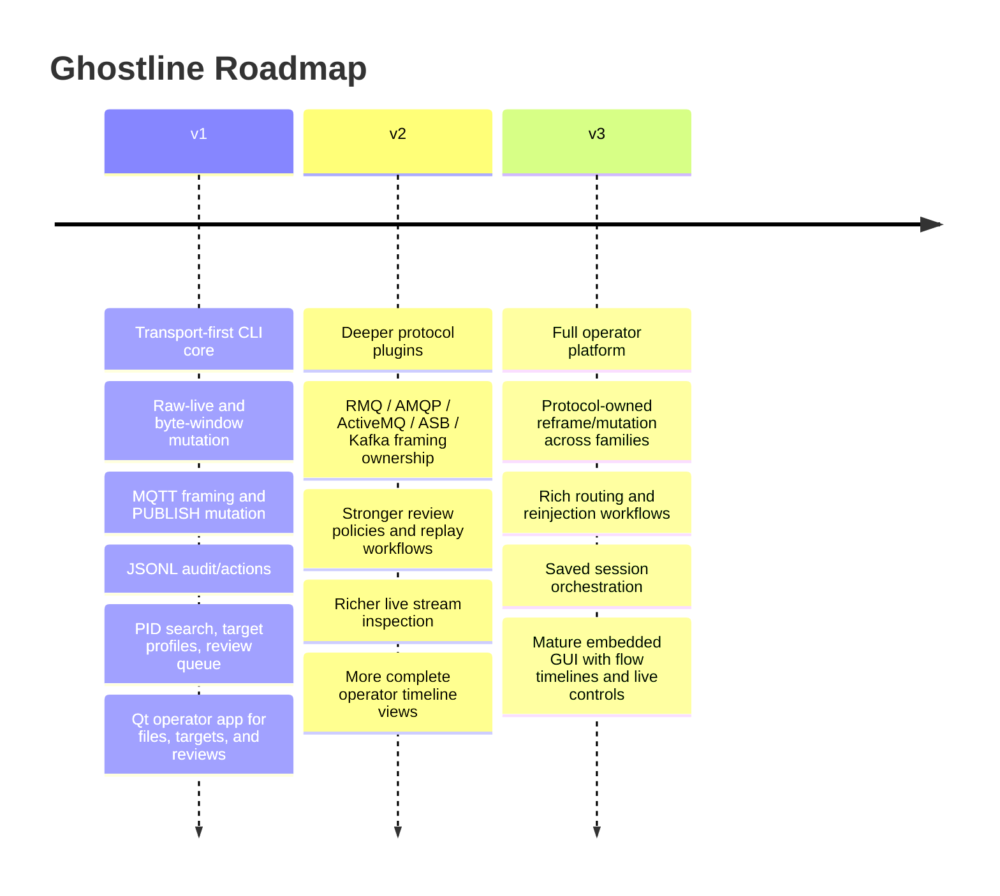

# Ghostline Gate

Ghostline Gate is a transport-first interception and mutation workbench for live TCP traffic. It is built around one rule above all others:

**original delivery always wins unless Ghostline can prove a modified release is safe.**

Today, Ghostline is a macOS-first Phase 1 system with a production-shaped CLI core, a usable Qt operator app, compiled-in protocol plugins, file-driven controls, JSONL audit/action streams, saved target profiles, and a pending review queue for risky mutations.



## What Ghostline Is

Ghostline is not a packet sniffer and not just a proxy. It sits in the middle as a relay-oriented control point that can:

- observe live TCP flows
- identify framed or frame-like windows
- stage `original` and `modified` candidates
- validate a modified candidate before release
- fall back to untouched original bytes when mutation risk is too high
- create operator review actions instead of silently forcing unsafe edits

The current product direction is:

1. observe and locate
2. frame and transform
3. route and end-transform
4. reframe when structure changes
5. support audit and research workflows

## Core Promise

Ghostline is built around **Safe Original Priority**:

- transport continuity must survive plugin uncertainty
- no partial modified candidate may leak
- failed mutation drops the modified path, not the flow
- risky cases become review items
- PID identity is metadata and targeting context, not the transport primitive

That makes Ghostline suitable for operator-guided mutation workflows where a bad replacement could expose the intervention.

## Current Architecture


```mermaid
flowchart LR
    A["Target Discovery\nPID / Port / State Search"] --> B["Transport Core\npoll() relay + duplex flow state"]
    B --> C["Plugin Layer\nraw-live / byte-window / mqtt / mq-family detectors"]
    C --> D["Candidate Engine\noriginal candidate\nmodified candidate"]
    D --> E["Validation Policy\nsafe to release?"]
    E -->|Yes| F["Modified Release"]
    E -->|No| G["Original Release"]
    E -->|Risk / Review| H["Action Item + Review Queue"]
    B --> I["Audit Streams\ntext + JSONL"]
    H --> J["Qt Operator App\nprofiles / files / reviews / replay"]
```

## Phase 1 Feature Set

### Transport Core

- portable `poll()` relay core
- directional independence and half-close awareness
- plugin-aware buffering ceilings
- safe fallback when framing or mutation cannot be completed

### Plugin Layer

Compiled into the binary today:

- `raw-live`
  raw chunk or end-marker driven live mutation
- `byte-window`
  generic start/end candidate matching
- `mqtt`
  authoritative framing with `PUBLISH` mutation and remaining-length reframe
- `rabbitmq`
  detection / audit target
- `amqp`
  detection / audit target
- `activemq`
  detection / audit target
- `azure-service-bus`
  detection / audit target
- `kafka`
  detection / audit target

### Operator Workflow

- saved target profiles
- seeded protocol target profiles for MQTT, RMQ, AMQP, ActiveMQ, Azure Service Bus, and Kafka
- pending review queue on disk
- approve / reject / replay actions
- file-driven controls via JSON, Jinja-style JSON, and lightweight HCL/Terraform-style configs
- text and JSONL audit streams

### Qt App

The embedded Qt operator app is usable today for:

- target discovery
- saved profile management
- review queue operations
- replay artifact generation
- loading rules, profiles, review items, and JSONL streams from disk

## Repository Map

```text
include/                 Public headers for models, plugins, pid search, operator state
src/                     Core engine, CLI, Qt app, audit, plugins, operator workflow
tests/                   C++ tests, Python simulation harnesses, fixtures
examples/                Rules, Python adapter example, Lua adapter example
docs/                    Cheatsheet and supporting docs
man/                     man page source
tools/                   Rules resolver and utility scripts
PHASE1_RUNBOOK.md        Canonical implementation workflow
sim.bash                 Local end-to-end simulation harness
```

## Build

```bash
cmake -S . -B build-local
cmake --build build-local
ctest --test-dir build-local --output-on-failure
```

Qt is enabled by default in CMake when Qt6 Widgets is available. To build the Qt target explicitly:

```bash
cmake -S . -B build-local -DGHOSTLINE_BUILD_QT=ON
cmake --build build-local --target ghostline_qt
```

## Run the CLI

Raw live mutation:

```bash
./build-local/ghostline_cli 7777 127.0.0.1 8888 \
  --raw-live \
  --raw-find-text old \
  --replace-text new \
  --raw-chunk-bytes 1024 \
  --protocol-hint raw-live
```

MQTT mutation:

```bash
./build-local/ghostline_cli 7777 127.0.0.1 1883 \
  --replace-text patched-payload \
  --protocol-hint mqtt
```

Rules-driven run:

```bash
./build-local/ghostline_cli 7777 127.0.0.1 8888 \
  --rules examples/rules/raw-live.json
```

Useful help surfaces:

```bash
./build-local/ghostline_cli -h
./build-local/ghostline_cli --help-rules
./build-local/ghostline_cli --help-search
./build-local/ghostline_cli --help-profiles
./build-local/ghostline_cli --help-review
./build-local/ghostline_cli --help-examples
./build-local/ghostline_cli --help-cheatsheet
```

Man page:

```bash
MANPATH="$PWD/man:${MANPATH}" man ghostline_cli
```

## Run the Qt App

```bash
./build-local/ghostline_qt
```

### Qt Operator Map


```mermaid
flowchart TB
    A["Targets Tab"] --> A1["PID Search"]
    A --> A2["Save / Load Target Profiles"]
    A --> A3["Seed Protocol Profiles"]
    A --> A4["Open Profile File"]

    B["Reviews Tab"] --> B1["Pending Review Queue"]
    B --> B2["Approve / Reject"]
    B --> B3["Replay Artifact Creation"]
    B --> B4["Open Review File"]

    C["Files Tab"] --> C1["Load Rules Files"]
    C --> C2["Load Audit JSONL"]
    C --> C3["Load Action JSONL"]
    C --> C4["Inspect Raw File Entries"]
```

## Rules and External Control

Ghostline supports file-driven control so sessions are reproducible and scriptable.

Supported rule inputs:

- JSON
- Jinja-style JSON templates rendered with `--rules-var key=value`
- lightweight HCL/Terraform-style flat assignments

Supported machine-readable outputs:

- `--audit-json <path>`
- `--actions-json <path>`

Example Jinja-driven MQTT run:

```bash
./build-local/ghostline_cli 7777 127.0.0.1 1883 \
  --rules examples/rules/mqtt_publish.jinja \
  --rules-var replacement_text=patched-payload \
  --rules-var mqtt_review_threshold=8 \
  --rules-var audit_json_path=sim-output/mqtt/audit.jsonl \
  --rules-var action_json_path=sim-output/mqtt/actions.jsonl
```

Example lightweight HCL/Terraform-style control:

```hcl
protocol_hint = "raw-live"
raw_live = true
raw_find_text = "hello"
replace_text = "patch"
mutate_direction = "c2s"
raw_chunk_bytes = 1024
raw_review_threshold_bytes = 8
audit_json_path = "ghostline_audit.jsonl"
action_json_path = "ghostline_actions.jsonl"
```

## Target Discovery and Profiles

Find candidate targets:

```bash
./build-local/ghostline_cli --search-pid mqtt
./build-local/ghostline_cli --search-port 1883 --listen-only
./build-local/ghostline_cli --search-json --search-pid ollama
```

Save or inspect profiles:

```bash
./build-local/ghostline_cli --save-target-profile /tmp/targets/ollama.json --target-label ollama-local
./build-local/ghostline_cli --show-target-profile /tmp/targets/ollama.json
./build-local/ghostline_cli --list-target-profiles ghostline_target_profiles
```

Seed protocol presets:

```bash
./build-local/ghostline_cli --seed-target-profiles ghostline_target_profiles
```

Preset targets written today:

- MQTT on `1883`
- RabbitMQ / RMQ on `5672`
- AMQP on `5672`
- ActiveMQ on `61616`
- Azure Service Bus on `5671`
- Kafka on `9092`

## Review Queue and Replay

Ghostline records risky mutations as action items instead of forcing them through.

Review queue commands:

```bash
./build-local/ghostline_cli --review-list
./build-local/ghostline_cli --review-approve action-1-3 --review-note approved
./build-local/ghostline_cli --review-reject action-1-3 --review-note rejected
./build-local/ghostline_cli --review-replay action-1-3 --review-note replay-now
```

Replay creates an operator artifact for later action. It does not inject traffic into a live flow yet.

## Simulation and Test Mode

Run the local simulation harness:

```bash
MODE=raw ./sim.bash
MODE=mqtt ./sim.bash
```

The sim harness:

- builds Ghostline
- starts a host and server
- runs `ghostline_cli`
- asserts expected mutation behavior
- checks audit and action streams

Artifacts are typically written under [sim-output](/Users/premise/Documents/github/ghostline-gate/sim-output).

## Version Timeline


```mermaid
timeline
    title Ghostline Roadmap
    v1 : Transport-first CLI core
       : Raw-live and byte-window mutation
       : MQTT framing and PUBLISH mutation
       : JSONL audit/actions
       : PID search, target profiles, review queue
       : Qt operator app for files, targets, and reviews
    v2 : Deeper protocol plugins
       : RMQ / AMQP / ActiveMQ / ASB / Kafka framing ownership
       : Stronger review policies and replay workflows
       : Richer live stream inspection
       : More complete operator timeline views
    v3 : Full operator platform
       : Protocol-owned reframe/mutation across families
       : Rich routing and reinjection workflows
       : Saved session orchestration
       : Mature embedded GUI with flow timelines and live controls
```

## Plugin Evolution Map

| Version | Plugin State | GUI State | Operator State |
| --- | --- | --- | --- |
| `v1` | Raw-live, byte-window, MQTT active; MQ-family detection profiles compiled in | Targets, Reviews, Files tabs | Profiles, queue, replay artifacts |
| `v2` | Multi-protocol framing ownership | Live flow summaries and richer review views | Review thresholds and replay workflows deepen |
| `v3` | Full protocol family mutation/reframe platform | Embedded operator console with live timelines | Session orchestration and routing workflows |

## Current Limitations

- MQTT is the only protocol-owned framing/mutation plugin today.
- RMQ, AMQP, ActiveMQ, Azure Service Bus, and Kafka are still seeded and compiled as detection / audit targets, not full mutation owners.
- The Qt app loads files and manages operator workflow, but it does not yet render a full live session timeline.
- HCL/Terraform support is intentionally lightweight and flat, not a full Terraform evaluator.

## Where To Extend Next

- deepen protocol framing for the MQ-family plugins
- add richer live flow timelines to Qt
- connect replay artifacts to future guided reinjection
- keep [PHASE1_RUNBOOK.md](/Users/premise/Documents/github/ghostline-gate/PHASE1_RUNBOOK.md) as the canonical implementation workflow

## Quick Links

- Runbook: [PHASE1_RUNBOOK.md](/Users/premise/Documents/github/ghostline-gate/PHASE1_RUNBOOK.md)
- Cheatsheet: [docs/ghostline_cli_cheatsheet.md](/Users/premise/Documents/github/ghostline-gate/docs/ghostline_cli_cheatsheet.md)
- Man page: [man/man1/ghostline_cli.1](/Users/premise/Documents/github/ghostline-gate/man/man1/ghostline_cli.1)
- Qt app: [src/qt_operator_main.cpp](/Users/premise/Documents/github/ghostline-gate/src/qt_operator_main.cpp)
- Core transport: [src/transport_core.cpp](/Users/premise/Documents/github/ghostline-gate/src/transport_core.cpp)
